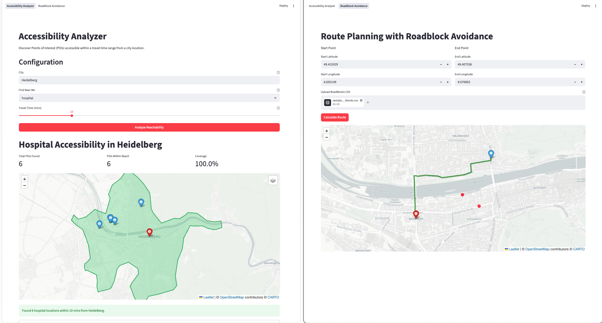

# Jubilant Guide

A Streamlit application for advanced route planning and accessibility analysis using OpenRouteService (ORS). Explore optimal routes while avoiding roadblocks and discover points of interest (POIs) within travel time ranges.

## Features

### 1. **Roadblock Avoidance**
- Plan routes while dynamically avoiding roadblocks
- Upload roadblocks via CSV file (latitude, longitude format)
- View route metrics including distance and estimated time
- Interactive map visualization with start, end, and roadblock markers
- Results caching for improved performance

### 2. **Accessibility Analyzer**
- Discover Points of Interest (POIs) within a specified travel time from a location
- Search for amenities: hospitals, pharmacies, cafes, restaurants, banks, schools
- Visualize reachable areas using isochrone maps
- City-based geolocation support

## Project Structure

```
jubilant-guide/
├── src/
│   ├── __init__.py
│   ├── cache.py              # Disk cache management
│   ├── db.py                 # Database utilities
│   ├── routing.py            # ORS routing client
│   ├── components/
│   │   ├── roadblock.py      # Roadblock logic and visualization
│   │   └── isochrone.py      # Isochrone and POI filtering
│   └── pages/
│       ├── accessibility_analyzer.py
│       └── roadblock_avoidance.py
├── ors-docker/               # ORS Docker configuration and data
│   ├── config/
│   ├── elevation_cache/
│   ├── files/
│   ├── graphs/
│   └── logs/
├── app.py                    # Main Streamlit application
├── pyproject.toml            # Project configuration
├── docker-compose.yml        # ORS Docker Compose setup
├── Makefile                  # Convenient CLI commands
└── README.md                 # This file
```

## Prerequisites

- **Python**: 3.11 or higher
- **Docker**: For running OpenRouteService locally
- **uv**: Python package manager (recommended) - [Installation guide](https://docs.astral.sh/uv/getting-started/installation/)

## Installation

### 1. Clone the Repository

```bash
git clone <repository-url>
cd jubilant-guide
```

### 2. Install Dependencies using `uv`

```bash
# Using Makefile
make install

# Or directly with uv
uv sync
```

This will:
- Create a virtual environment
- Install all dependencies from `pyproject.toml`
- Set up the development environment

### 3. Environment Setup

No additional environment variables are required for local development. The application connects to ORS at `http://localhost:8080/ors` by default.

**Optional**: To customize ORS connection, modify the `BASE_URL` in `src/routing.py`:
```python
BASE_URL = "http://localhost:8080/ors"
```

## Running OpenRouteService (ORS) Locally

### Prerequisites for ORS

- Docker and Docker Compose installed
- Minimum 2GB RAM available for ORS
- Disk space: ~2GB for graphs and elevation cache

### Start ORS Service

```bash
# Using Makefile
make orsup

# Or directly with docker compose
docker compose up -d
```

The ORS service will:
- Build/pull the ORS container (v9.8.0)
- Expose API on `http://localhost:8080`
- Load the example Heidelberg routing graph
- Cache elevation data automatically

**Wait for service to be ready** (1-5 minutes depending on system):
```bash
curl http://localhost:8080/ors/v2/health
```

Expected response:
```json
{"status":"ready"}
```

### Stop ORS Service

```bash
# Using Makefile
make orsdown

# Or directly
docker compose down
```

### ORS Configuration

The ORS configuration is managed through:
- **Config file**: `ors-docker/config/ors-config.yml`
- **Environment variables**: Set in `docker-compose.yml` under `environment:`

Key settings in `docker-compose.yml`:
```yaml
XMS: 1g              # Initial JVM heap size
XMX: 2g              # Maximum JVM heap size
REBUILD_GRAPHS: False # Rebuild routing graphs on startup
```

To use custom graph data:
1. Place PBF files in `ors-docker/files/`
2. Update config in `ors-docker/config/ors-config.yml`
3. Restart the container

## Running the Application

### Development Mode

```bash
# Using Makefile
make run

# Or directly
uv run streamlit run app.py
```

The application will be available at: `http://localhost:8501`

### Stop the Application

```bash
make stop
```

## Usage Guide

### Roadblock Avoidance

1. Open the **Roadblock Avoidance** page from the navigation menu
2. Enter start and end coordinates (default: Heidelberg example)
3. Configure settings in the sidebar:
   - **Search Buffer**: Defines the search area around the route (1-20km)
   - **Roadblock Radius**: Size of avoidance zones (10-100 meters)
   - **Avoidance Buffer**: Margin around roadblocks (0.0001-0.001 degrees)
4. Upload a CSV file with roadblock locations:
   ```csv
   latitude,longitude
   49.408663957747,8.689759402170136
   49.41017207323517,8.686369285199621
   ```
5. Click **Calculate Route** to compute the optimal path
6. View results with distance, time, and interactive map

### Accessibility Analyzer

1. Open the **Accessibility Analyzer** page
2. Enter a city name (default: Heidelberg)
3. Select the type of amenity to search for
4. Set the travel time range (5-30 minutes)
5. Click **Analyze Reachability** to find accessible POIs
6. View results with:
   - Reachable area (isochrone) highlighted on the map
   - All POIs within range
   - Accessibility statistics



## Available Commands

```bash
make install    # Install dependencies using uv
make clean      # Remove virtual environment and cache
make run        # Start Streamlit application
make stop       # Stop the application
make orsup      # Start ORS Docker service
make orsdown    # Stop ORS Docker service
```

## Troubleshooting

### ORS Service Connection Error

**Error**: `Error calculating route: Connection refused`

**Solution**:
1. Verify ORS is running: `docker ps | grep ors-app`
2. Check service health: `curl http://localhost:8080/ors/v2/health`
3. Check container logs: `docker logs ors-app`
4. Restart the service:
   ```bash
   make orsdown
   make orsup
   ```

### CSV Upload Errors

**Error**: `CSV must contain columns: latitude, longitude`

**Solution**:
- Ensure your CSV has exactly these column headers (case-sensitive)
- Example format:
  ```csv
  latitude,longitude
  49.40,8.68
  ```

### Memory Issues with ORS

**Error**: `Container exits or becomes unresponsive`

**Solution**:
1. Increase JVM heap size in `docker-compose.yml`:
   ```yaml
   XMS: 2g  # Increase from 1g
   XMX: 4g  # Increase from 2g
   ```
2. Rebuild and restart:
   ```bash
   make orsdown
   make orsup
   ```

### Port Already in Use

**Error**: `Port 8080 is already allocated`

**Solution**:
Option 1: Change the port mapping in `docker-compose.yml`:
```yaml
ports:
  - "8090:8082"  # Use 8090 instead
```

Option 2: Find and stop the process:
```bash
lsof -i :8080
kill -9 <PID>
```

## Data Caching

The application uses disk caching to improve performance:
- **Route Cache**: Caches computed routes to avoid recalculation
- **Location**: `cache/` directory
- **Automatic**: Caching is handled automatically by the application

To clear cache:
```bash
make clean
rm -rf cache/
```